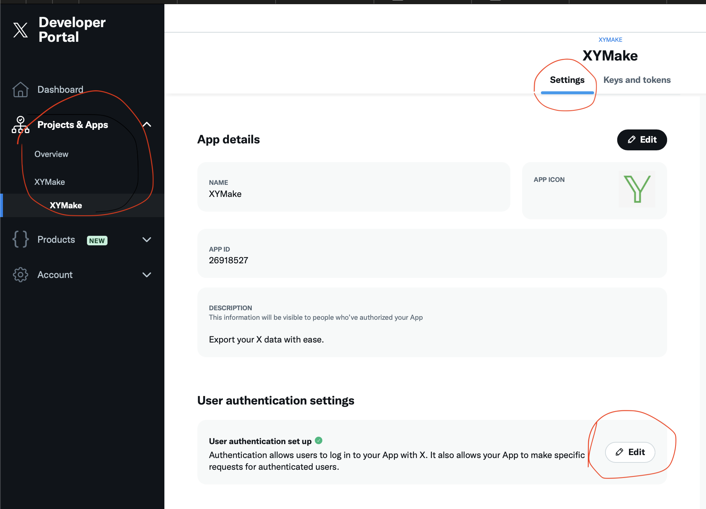

This is a template made from first principles, for secure login via X OAuth. Use this boilerplate fore easy creation of apps that require X login. If you like to combine this with DORM for sharded databases, see [x-dorm-template](https://github.com/janwilmake/x-dorm-template)

To use this:

- make a client at https://developer.x.com
- make sure to provide the right "User authentication settings", specifically the callback URLs should include https://your-worker.com/callback
- Ensure to get the OAuth client/secret, as highlighted below
- gather all vars in both `.dev.vars` and `wrangler.toml`, and in your deployed secrets

You can add as many callbacks as you want (for all your X oauthed workers)!

> [!WARNING]
> X Free Plan has low ratelimits you should be aware of. Also there have been issues from my end when using this from cloudflare workers: https://x.com/janwilmake/status/1940654226138374256
